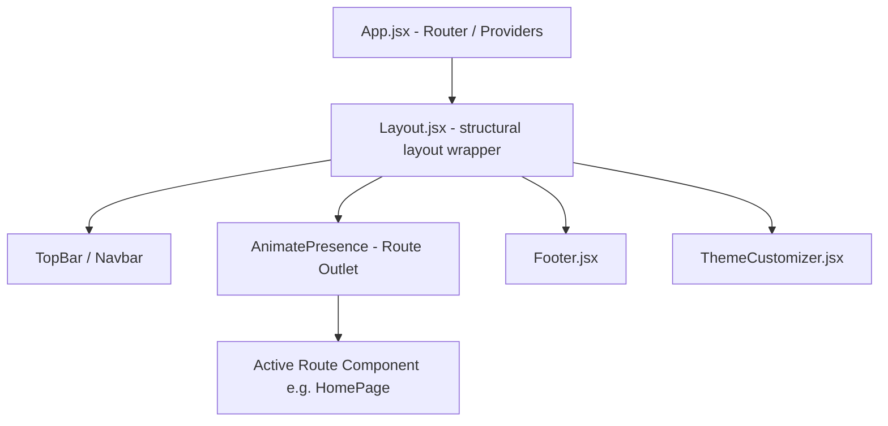
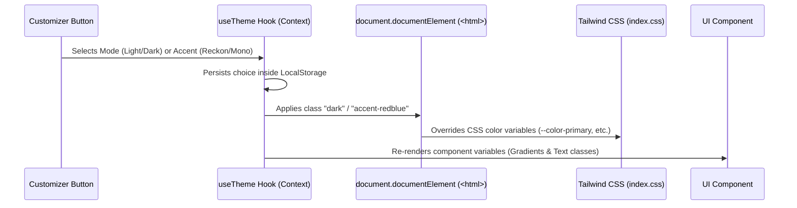

# Reckon ERP & Billing portal — Project Manual & Architecture Handbook

This document is a comprehensive guide to the **Reckon ERP & Billing Software Web Application**. It outlines the technology stack, application architecture, structural layout mappings, theme/accent customization system, data configurations, and quick-start instructions.

---

## 🚀 1. Quick Start & Installation

### Prerequisites
* **Node.js:** Ensure Node.js (v18 or higher is recommended) is installed on your machine.

### Installation Steps
1. Navigate to the project root directory and install dependencies:
   ```bash
   npm install
   ```
2. Launch the local development server:
   ```bash
   npm run dev
   ```
   Open the address provided by Vite (usually `http://localhost:5173/` or `http://localhost:5175/`) in your web browser.
3. Build the application for production (results are compiled in the `dist/` directory):
   ```bash
   npm run build
   ```

---

## 🛠️ 2. Core Technology Stack

This application is engineered as a modern, high-performance **Single Page Application (SPA)** utilizing the following software stack:

* **React (v19):** Controls component rendering, custom hooks, dynamic state, and page layout updates.
* **Vite:** High-speed bundler providing instant Hot Module Replacement (HMR) during development.
* **TailwindCSS (v4):** Handles global styling. Custom brand parameters are injected directly into `@theme` overrides in CSS.
* **Framer Motion (v12):** Drives structural screen fades, scroll entry transitions, floating mockup badge animations, and spotlight effects.
* **Lucide React:** Supplies responsive SVG iconography optimized for mobile and desktop screens.
* **React Router Dom (v7):** Implements smooth, client-side declarative page routing.
* **React Helmet Async:** Dynamically updates page `<title>` and `<meta>` tags for SEO optimization.

---

## 📂 3. Directory Map & File Functions

```bash
Reckon/
├── public/                 # Static assets folder
│   ├── favicon.png         # Main favicon image
│   ├── favicon.svg         # SVG vector favicon file
│   └── images/             # Marketing mockups, illustrative cards, and client logos
├── src/
│   ├── main.jsx            # Mounts the React application tree inside index.html
│   ├── App.jsx             # Declares routes and wraps page layouts in hooks
│   ├── index.css           # Core styling containing Tailwind definitions and scrollbars
│   │
│   ├── hooks/              # Custom React Hooks
│   │   ├── useTheme.jsx    # React Context Provider managing color modes and accents
│   │   └── useScrollAnimation.js # Triggers sliding transitions when sections scroll into view
│   │
│   ├── data/               # Centralized content files
│   │   ├── softwares.js    # Data properties for retail apps, industries, and ERP solutions
│   │   ├── navigation.js   # Stores menu links, contact addresses, and social redirects
│   │   └── testimonials.js # Contains statistics values and customer review quotes
│   │
│   ├── pages/              # Main Route Containers
│   │   ├── HomePage.jsx          # Front landing page structure
│   │   ├── AboutPage.jsx         # Company description and team indicators
│   │   ├── SoftwaresPage.jsx     # Product search grid with category filters
│   │   ├── SoftwareDetailPage.jsx# Dynamic software product details template
│   │   ├── ContactPage.jsx       # Contact form, sales helpdesk, and Google Maps embed
│   │   └── ... (Tutorials, Help, Gallery, Downloads, NotFound)
│   │
│   └── components/         # Modular Component UI Blocks
│       ├── layout/         # Core Layout Structures
│       │   ├── Layout.jsx          # Structural wrapper containing Topbar, Navbar, and Footer
│       │   ├── TopBar.jsx & Navbar.jsx # Header navigation components
│       │   ├── Footer.jsx          # Clean, theme-adaptive compact bottom bar
│       │   └── ThemeCustomizer.jsx # Customizer panel drawer (theme & accent toggle)
│       │
│       ├── home/           # HomePage Specific Sections
│       │   ├── HeroSection.jsx     # Floating mockup, typing headlines, and hero details
│       │   ├── FeaturesGrid.jsx    # Product features panel
│       │   ├── StatsCounter.jsx    # Animated company statistics counter
│       │   ├── TestimonialsSlider.jsx # Grid of compact client review cards
│       │   └── CTASection.jsx      # Dynamic gradient Call-To-Action panel
│       │
│       └── shared/         # Reusable Component Cards
│           ├── PageHeader.jsx      # Dynamic layout subpage headers
│           ├── FeatureCard.jsx     # Generic feature card structure
│           └── StatCard.jsx        # Individual metric card playing scale animation
```

---

## 🧭 4. Layout & Navigation Architecture

All routes are nested inside a master component wrapper defined in `Layout.jsx`. 



When a user switches routes, `<AnimatePresence>` intercepts the change, triggers a smooth exit animation, slides the old content out, and transitions the new container page in seamlessly.

---

## 🎨 5. Dynamic Theme & Accent Customize Pipeline

The styling pipeline is built around two customization properties: **Color Mode (Light/Dark)** and **Accent Selection**.



### Color Mode Configuration
* **Light Mode:** Uses clean, off-white backdrops (`#FAFAFA`) with high-contrast text (`#0A0A0A`).
* **Dark Mode:** Activates by applying the `.dark` class to the root `<html>`. Key background variables are overridden inside the `.dark` class in `index.css`:
  * `--color-background: #0B0816` (Deep brand purple)
  * `--color-surface: #130F24` (Slightly lighter violet)
  * `--color-surface-hover: #1C1735`

### Accent Theme Customization
Highlights, active links, and buttons read `--color-primary` and `--color-accent` variables from Tailwind. Changing the accent selector updates the root class:
* **Reckon Accent (`redblue`):** Map primary highlights to Crimson Red (`#DC2626`) and accents to Royal Blue (`#2563EB`). It is set as the default accent.
* **Mono Accent (`mono`):** Classic, clean gray/white styling overrides.

### Theme-Adaptive Gradients
Major blocks (`HeroSection`, `Footer`, `CTASection`, and `PageHeader` when `gradient={true}`) toggle their gradient background styles dynamically based on the active theme:
* **Light Mode:** Coral-pink to sky-blue gradient (`linear-gradient(135deg, #FF8B77 0%, #E9EDFF 50%, #4F9CFC 100%)`).
* **Dark Mode:** Moody burgundy-red to deep-blue gradient (`linear-gradient(135deg, #2B070B 0%, #110B24 50%, #071530 100%)`).

---

## 📊 6. Content Configuration Guide

To edit text lists, product features, and testimonials without touching component code, open the files in `src/data/`:

### A. Modifying Products & Categories (`src/data/softwares.js`)
Contains data objects mapped to category grids. Insert or edit objects inside `BUSINESS_APPS`, `VERTICALS`, or `ERP_SOLUTIONS`:
```javascript
{
  slug: 'custom-product-path',
  name: 'Product Name',
  tagline: 'Catchy marketing phrase',
  icon: ShoppingCart, // Import appropriate icon from lucide-react at the top
  color: '#2563EB',   // Card hover glow color
  description: 'Detailed description text.',
  features: [ 'Feature 1', 'Feature 2' ]
}
```

### B. Appending Customer Reviews (`src/data/testimonials.js`)
Append review cards inside `TESTIMONIALS`:
```javascript
{
  id: 11,
  name: 'Reviewer Name',
  designation: 'Owner',
  company: 'Store Name',
  industry: 'Pharmacy', // Mapped color category
  quote: 'Testimonial quote text here.',
  rating: 5,
}
```

---

## 🌊 7. Animation Rules & Best Practices

1. **Avoid Animation Fighting:** Never add CSS transition rules (like `transition-all` or `transition-transform`) inside classes of elements animated by Framer Motion. This causes coordinate stutters and freezes the loop. Always use specific properties (like `transition-colors`) instead.
2. **Compact Visual Cards:** Testimonial cards are styled with compact layouts (`p-5` padding, smaller avatar circles, and tight line heights) to maximize content visibility and flow.
3. **Floating Badges:** Elements like **Cloud Powered** and **GST Ready** float on an infinite loops (`repeat: Infinity` and `ease: 'easeInOut'`) to add organic movement to the hero mockups.
